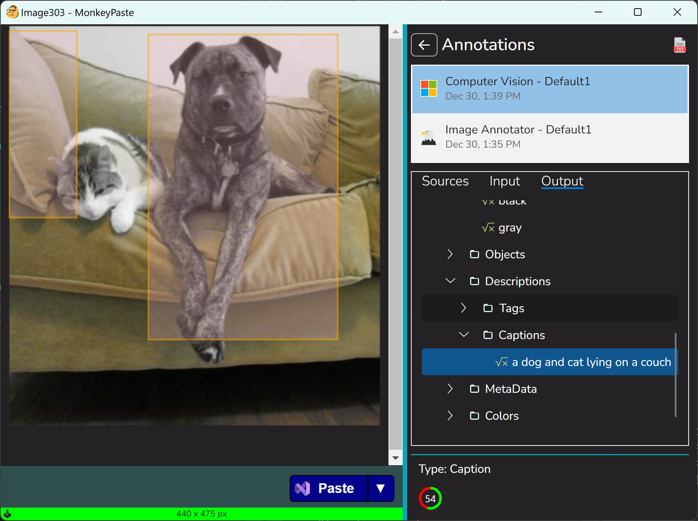

# ComputerVision
An image annotator plugin using [Azure AI Vision](https://azure.microsoft.com/en-us/products/ai-services/ai-vision) for [MonkeyPaste](https://www.monkeypaste.com).

## Requirements
- An installation of [MonkeyPaste](https://www.monkeypaste.com/download) 
- An [Azure Cognitive Services API key and region Url](https://azure.microsoft.com/en-us/free/ai-services/) (there's free-tier option at the time of this writing)
## Remarks
This project can be used as a reference for anyone interested in [plugin development](https://www.monkeypaste.com/docs/plugins/plugin-development) for [MonkeyPaste](https://www.monkeypaste.com).

Here's some highlights of what it demonstrates:
- Headless parameter definitions
- Execution Parameters
- Shared Value Parameters
- Reading images from MonkeyPaste
- Creating annotation trees using `MpImageAnnotationNodeFormat`
- Error handling with the host application

## Special Thanks

https://json2csharp.com/ - a very useful and free online tool to quickly convert json into basic (poco) c# classes