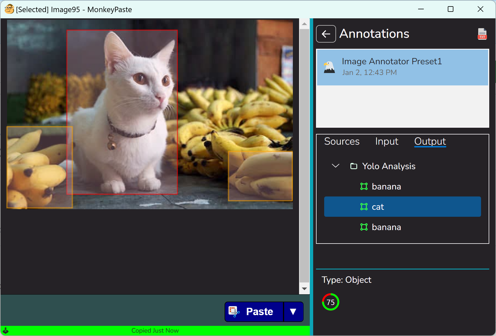

# Image Annotator
An image annotator plugin for [MonkeyPaste](https://www.monkeypaste.com).

## Requirements
- An installation of [MonkeyPaste](https://www.monkeypaste.com/download) 
- (Windows 10 & 11) The latest [Visual C++ Redistributable Package](https://learn.microsoft.com/en-us/cpp/windows/latest-supported-vc-redist?view=msvc-170)

## Remarks
This project can be used as a reference for anyone interested in [plugin development](https://www.monkeypaste.com/docs/plugins/plugin-development) for [MonkeyPaste](https://www.monkeypaste.com).

Here's some highlights of what it demonstrates:
- Reading images from MonkeyPaste
- Creating annotation trees using `MpImageAnnotationNodeFormat`
- Error handling with the host application

## Special Thanks

https://github.com/dme-compunet/YOLOv8 - A nice yolo wrapper handling underlying image detection
https://github.com/ultralytics/ultralytics - Model source